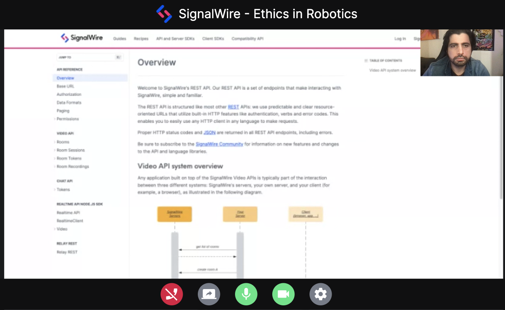
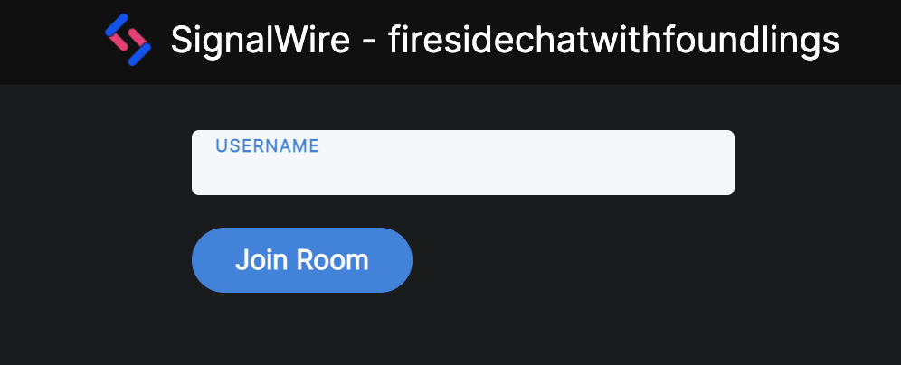

# signalwire-video-vuejs
An example video conferencing app built in VueJS 3 using the SignalWire Video API and SignalWire Javascript SDK with reuseable components. 

This sample application relies on the [SignalWire Video API](https://developer.signalwire.com/apis/reference/overview) and the [SignalWire Javascript SDK](https://developer.signalwire.com/client-sdk/docs/getting-started). We do all the heavy lifting so that all you need to do is focus on building your application.

# Table of Contents
- [signalwire-video-vuejs](#signalwire-video-vuejs)
- [Table of Contents](#table-of-contents)
- [Features](#features)
- [SignalWire Video Conferencing API](#signalwire-video-conferencing-api)
- [Getting Started](#getting-started)
  - [Local Setup](#local-setup)
  - [Using Replit](#using-replit)
- [Frontend Docs](#frontend-docs)
- [Backend Docs](#backend-docs)

# Features

- Join or create temporary room session.
  
- Screen share

- Change devices or layouts.
  
- List Active Room Sessions with Rooms Previews
  
- Join active Rooms from list.
  
- Meeting controls (Mute Audio and Video)
- Create Persistant Rooms.
- Create Invite Links to join a room session.

# SignalWire Video Conferencing API

Other video conferencing APIs and applications rely on SFU (Selective Forwarding Unit) which means every user is responbile for streaming to and decoding the streams of other users. The SignalWire Video Conferencing API takes an MCU (Multipoint Control Unit) approach which reduces the load on the end users and results in minimized latency and the ability to participate in large-scale calls within a browser. 

# Getting Started

The application has two parts, the [frontend](./frontend) and the [backend](./backend). They're built to run independantly but the frontend does require the backend in order to make requests to the SignalWire Video API. Instructions are provided for running each independantly in a virtual environment using replit.com or running locally on your machine. 

## Local Setup

This guide walks you through setting up the example application using a terminal and NodeJS. At the time of writing this it has been tested on OSX and Linux.

[Local Setup](./docs/local-setup.md)

## Using Replit

This guide walks you through using Replit, a cloud based coding environment, to run both the backend and the frontend. The end result is a hosted instance with a link that can be shared for others to use. 

[Using Replit](./docs/using-replit.md)

# Frontend Docs

The frontend is built in Vue 3. This doc goes over all the components, framework specific details, and the api helper class. 

[Frontend Docs](docs/frontend.md)
# Backend Docs

The backend is a simple NodeJS Express server. It interacts with the SignalWire API. 

[Backend Docs](docs/backend.md)
