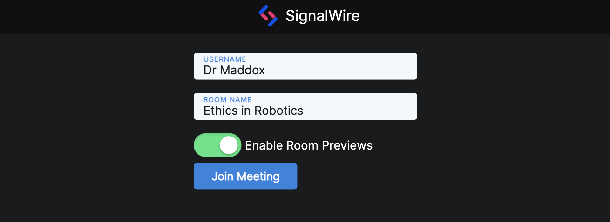
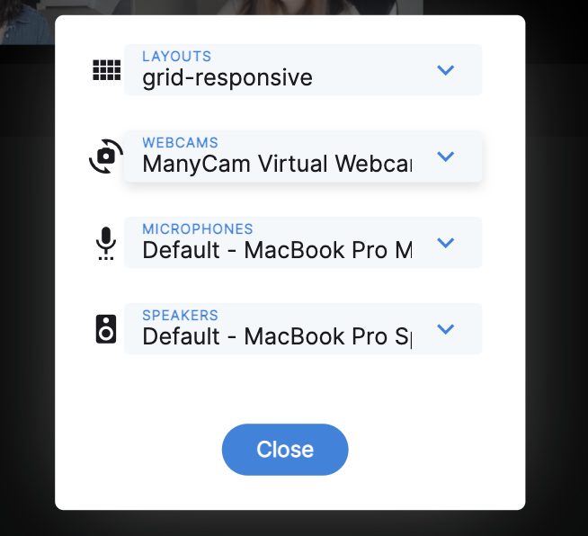

# SignalWire Video VueJS Frontend

The frontend for this sample application is built using the VueJS 3 framework. It is a web framework for building application using javascript. This document will give an overview of this projects structure as well as an explanation for all the components.

# Table of Contents
- [SignalWire Video VueJS Frontend](#signalwire-video-vuejs-frontend)
- [Table of Contents](#table-of-contents)
  - [Vue Specific](#vue-specific)
    - [Vuestic](#vuestic)
    - [Environment Variables](#environment-variables)
    - [Vue Config JS](#vue-config-js)
  - [Components](#components)
    - [Home](#home)
    - [InCall](#incall)
    - [CreateRoomForm](#createroomform)
    - [JoinRoomForm](#joinroomform)
    - [ListRooms](#listrooms)
    - [LoadingCard](#loadingcard)
    - [MeetingControls](#meetingcontrols)
    - [RoomSettings](#roomsettings)
    - [SignalWireRoom](#signalwireroom)
    - [TopAppBar](#topappbar)
  - [API Helper](#api-helper)
    - [Functions](#functions)
      - [fetchBackendUrl](#fetchbackendurl)
      - [joinWithUsername](#joinwithusername)
      - [listActiveRoomSessions](#listactiveroomsessions)
      - [listRoomSessions](#listroomsessions)
      - [createRoom](#createroom)

## Vue Specific

A couple of things to note in this project that are related to using Vue in this context and are not to do with the usage of the SignalWire SDK. 

### Vuestic

[Vuestic](https://vuestic.dev/) is a VueJS UI library that was used to build these components. See [frontend/src/main.js](../frontend/src/main.js) to see how it is added to the project.

### Environment Variables

The frontend defaults to expecting the API to be hosted at `localhost:3080`. This can be changed by adding a `.env` file to the root of the frontend directory. Since the project is built or served using a VUE CLI command, Vue requires environment variables to be prefixed with **VUE_APP_**

`frontend/.env`
```
VUE_APP_URL=<someURL>
```

### Vue Config JS

There is a file named `vue.config.js`. This exists to allow proxy requests sent to localhost:3080 without running into CORs errors.

```js
module.exports = {
    devServer: {
      proxy: {
        '^/api': {
          target: 'http://localhost:3080',
          changeOrigin: true
        },
      }
    }
  }
```

## Components

The App is constructed using several reuseable components. Several of the components use  `frontend/api-helper.js` which calls the custom backend that interacts with the SignalWire API.

Take a look at the difference between the Home and InCall components which are used as routes for separate pages. It will give you an idea how to reuse components. 

### Home

This component is used as the main route when you navigate to the app in a browser. It combines the use of the JoinRoomForm, ListRooms, LoadingCard, and SignalWireRoom components. 

**Implementation:**

Heres an overview of its code. 

**Template:**

```html
<template>
  <div class="home">
    <TopAppBar :roomname="roomname" />

    <div class="item" v-if="!roomStarted && !loadingRoom">
      <JoinRoomForm
        @roomCredentials="createRoom"
      />
    </div>

    <div class="item" v-if="!roomStarted && !loadingRoom">
      <ListRooms />
    </div>
    
    
    <LoadingCard 
      v-if="loadingRoom && !roomStarted"
      :username="username" 
      :roomname="roomname"
    />

    <SignalWireRoom  
      :token="token" 
      v-if="token"
      @loading="onLoading"
      @roomJoined="onRoomJoined"
      @roomEnded="onRoomEnded" 
    />

    
  </div>
</template>
```

**Script:**

```js
<script>
import SignalWireRoom from './components/SignalWireRoom.vue'
import JoinRoomForm from './components/JoinRoomForm.vue'
import LoadingCard from './components/LoadingCard.vue'
import ListRooms from './components/ListRooms.vue'
import TopAppBar from './components/TopAppBar.vue'

export default {
  name: 'Home',
  components: {
    SignalWireRoom,
    JoinRoomForm,
    LoadingCard,
    ListRooms,
    TopAppBar
  },
  data() {
    return {
      token: '',
      roomStarted: false,
      loadingRoom: false,
      username: '',
      roomname: ''
    }
  },
  methods: {
    createRoom(username, roomname, token) {
      this.username = username
      this.roomname = roomname
      this.token = token
    },
    onLoading() {
      this.loadingRoom = true
    },
    onRoomJoined() {
      this.roomStarted = true
    },
    onRoomEnded() {
      this.username = ''
      this.roomname = ''
      this.token = ''
      this.roomStarted = false
      this.loadingRoom = false
    }
  }
}
</script>
```

### InCall

InCall is similar to the Home component. The difference is that it only displays a form for entering a username and expects the roomname as a query param. This is used to create a page to share as an invite or as a way to join rooms from the room list. 

**Template:**

```html
<template>
  <div class="incall">
    <TopAppBar :roomname="roomname" />
    
    <div class="item" v-if="!loadingRoom && !roomStarted">
       <va-form
          style="width: 300px;"
          tag="form"
          @submit.prevent="joinWithUsername"
        >
          <va-input v-model="username" label="Username" />
          <br />

          <va-button type="submit">
            Join Room
          </va-button>
      </va-form>
    </div>
   
    
    <LoadingCard 
      v-if="loadingRoom && !roomStarted"
      :username="username" 
      :roomname="roomname"
    />

    <SignalWireRoom  
      :token="token" 
      v-if="token"
      @roomJoined="onRoomJoined"
      @roomEnded="onRoomEnded" 
    />

    
  </div>
</template>
```

**Script:**

```js
<script>
import SignalWireRoom from './components/SignalWireRoom.vue'
import LoadingCard from './components/LoadingCard.vue'
import TopAppBar from './components/TopAppBar.vue'

const helper = require('./api-helper')

export default {
  name: 'InCall',
  components: {
    SignalWireRoom,
    LoadingCard,
    TopAppBar
  },
  data() {
    return {
      token: '',
      roomStarted: false,
      loadingRoom: false,
      username: '',
      roomname: '',
    }
  },
  mounted() {
    this.getParams()
  },
  methods: {
    getParams() {
      let urlParams = new URLSearchParams(window.location.search);
      console.log(urlParams.get('roomname'))
      this.roomname = urlParams.get('roomname')
    },
    async joinWithUsername(){
      this.loadingRoom = true
      try {
        let token = await helper.joinWithUsername(this.roomname, this.username, true)
        this.token = token
      } catch (e) {
        console.log(e)
      }
    },
    onRoomJoined(){
      this.roomStarted = true
    },
    onRoomEnded() {
      window.location.href = '/'
    }
  }
}
</script>
```
### CreateRoomForm

A form for creating a persistant room. 

**Usage:**

```html
<CreateRoomForm
    @roomCredentials="createRoom"
/>
```

**Events**

- `roomCredentials` emits with (username, roomname, token) on submit.

This can be handled with a method and used to pass to a SignalWireRoom component. 

```js
methods: {
    createRoom(username, roomname, token) {
      this.username = username
      this.roomname = roomname
      this.token = token
    },
```

### JoinRoomForm

A form for joining or creating a Room session. 



**Usage:**

```html
<JoinRoomForm
    @roomCredentials="createRoom"
/>
```

**Events**

- `roomCredentials` emits with (username, roomname, token) on submit.

This can be handled with a method and used to pass to a SignalWireRoom component. 

```js
methods: {
    createRoom(username, roomname, token) {
      this.username = username
      this.roomname = roomname
      this.token = token
    },
```

### ListRooms

Uses the API Helper to request the list of rooms filtered by 'in-progress' and displays them as card. Includes Room Previews if they are available for the room.

**Usage:**

```html
<ListRooms />
```


### LoadingCard

Displays a loading card with the a Roomname and a Username. These can be binded variables. 

**Usage:**

```html
 <LoadingCard
    :username="username" 
    :roomname="roomname"
 />
```

### MeetingControls

This component displays Mute Audio, Mute Video, Share Screen, and End Call icon buttons. It expects a room object from the SignalWire Javascript SDK. Its methods call the SignalWire SDK functions for muting and sharing screen. 

For ending a call it tears down all screenshare objects and emits a hangup event, actuall room teardown is expected to happen in the parent component.

**Usage:**

```html
<MeetingControls
  :room="room"
  @hangup="onHangup"
/>
```

**Events**

- `hangup` emits when the user clicks the hangup icon. The method that handles this must handle the actual ending of a room.

Example Handler Method:
```js
async onHangup() {
  await this.room.hangup()
  this.room = null
  this.$emit('roomEnded')
},
```

### RoomSettings



**Usage:**

```html
<RoomSettings
  :room="room"
  :devices="devices"
/>
```

Where `devices` is an object:
```json
{
    "cameras": [],
    "microphones": [],
    "speakers": [],
    "layouts": []
}
```

and `room` is a room object from the SignalWire Javascript SDK.

Example Methods for collecting devices:
```js
async populateLayouts(){
  let layouts = await this.room.getLayouts()
  if(!layouts) return
  this.devices.layouts = layouts.layouts
  await this.room.setLayout({ name: "grid-responsive" })
},
mapDevices(devices){
  return devices.map((device, index) => {
    return {
      deviceId: device.deviceId,
      label: device.label,
      index
    }
  })
},
async populateVideoDevices(){
  let cameras = await SignalWire.WebRTC.getCameraDevicesWithPermissions()
  this.devices.cameras = this.mapDevices(cameras)
},
async populateAudioDevices(){
  let microphones = await SignalWire.WebRTC.getMicrophoneDevicesWithPermissions()
  let speakers = await SignalWire.WebRTC.getSpeakerDevicesWithPermissions()
  
  this.devices.microphones = this.mapDevices(microphones)
  this.devices.speakers = this.mapDevices(speakers)
}
```

### SignalWireRoom

Joins and displays a Room sessions with meeting controls if a valid Room Token is bound to the token prop.

**Usage:**

```html
<SignalWireRoom  
  :token="token" 
  v-if="token"
  @loading="onLoading"
  @roomJoined="onRoomJoined"
  @roomEnded="onRoomEnded" 
/>

```

**Events**

- `loading` emits on mounted.
- `roomJoined` emits when the room is joined and devices are populated.
- `roomEnded` emits when the room is ended.

### TopAppBar

The TopAppBar is a simple header component. If you bind a roomname to it and that roomname exists, it will adjust to display it. 

**Usage:**

```html
<TopAppBar :roomname="roomname" />
```

## API Helper

This is a Javascript helper class that includes functions that interact with the backend. Its used by several components.

### Functions

#### fetchBackendUrl

**Returns:** `URL set in environment or defaults to localhost:3080`

#### joinWithUsername

**Arguments:** `(roomname, username, enableRoomPreviews)`

**Returns:** `Room token`

#### listActiveRoomSessions

**Arguments:** `(rooms)`

**Returns:** `An array of rooms with status 'in-progress'`

#### listRoomSessions

**Arguments:** `None`

**Returns:** `An array of Room objects`

#### createRoom

**Arguments:** `(roomname, username, enableRoomPreviews)`

**Returns:** `A room token for accessing a persistant room`

