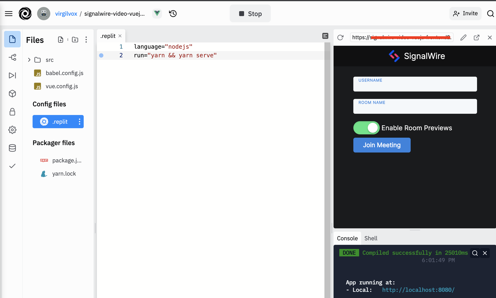
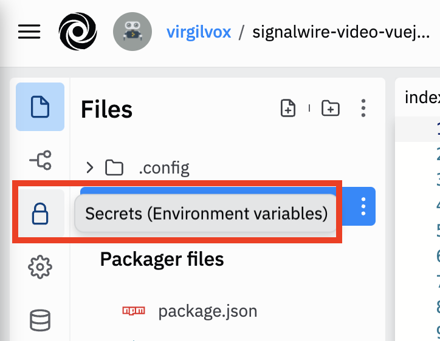
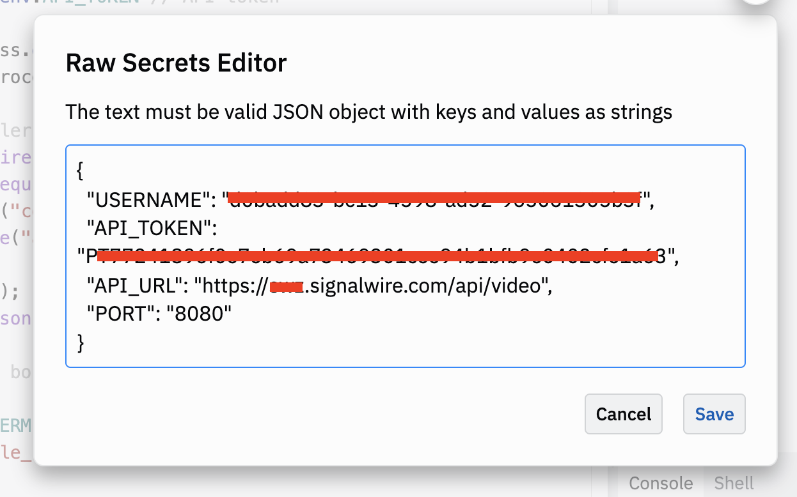

## Using Replit



Replit is a cloud based coding environment. It lets you upload code and run it in a virtual machine from your browser, for free! We have two premade Replits that you can fork to run the frontend and the backend. There are some variables that need to be set first. This guide walks you through that. 

Before beginning you'll need to create a SignalWire space and obtain some credentials. See [Getting Started with the SignalWire Video API](https://developer.signalwire.com/apis/docs/getting-started-with-the-signalwire-video-api-1).

### Replit Backend

1. Navigate to https://replit.com/@virgilvox/signalwire-video-vuejs-backend
2. Click on **fork**.
3. From the side menu select the lock shaped icon to open the **Secrets (Environment Variables)** options.

4. Click on **"Edit raw JSON"**. Paste in the following and add your own credentials.
```json
{
  "USERNAME": "",
  "API_TOKEN": "",
  "API_URL": "https://<your space>.signalwire.com/api/video",
  "PORT": "8080"
}
```


5. Click **Run** to start the server.
6. One running, the preview browser will display a link in its address bar. Copy this, you'll need it to configure the backend. 

### Replit Frontend

1. Navigate to https://replit.com/@virgilvox/signalwire-video-vuejs-frontend
2. Click on **fork**.
3. From the side menu select the lock shaped icon to open the **Secrets (Environment Variables)** options.
4. Add a new secret with the key `"VUE_APP_URL"`. Paste in the URL for the backend and click **"Add new secret"**.

5. Click **Run**.


